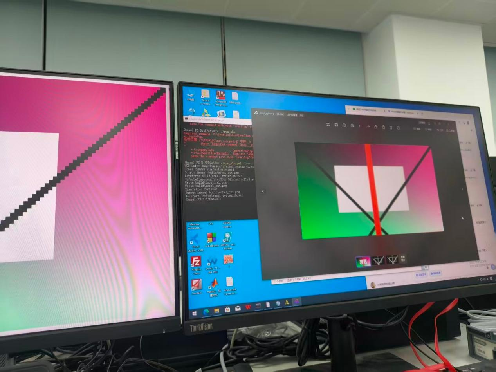
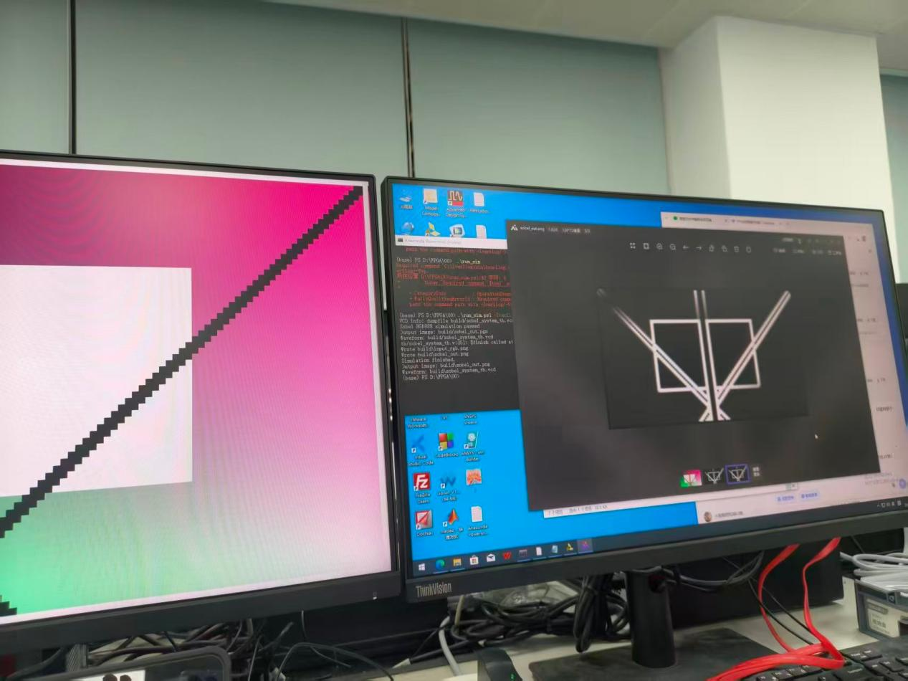
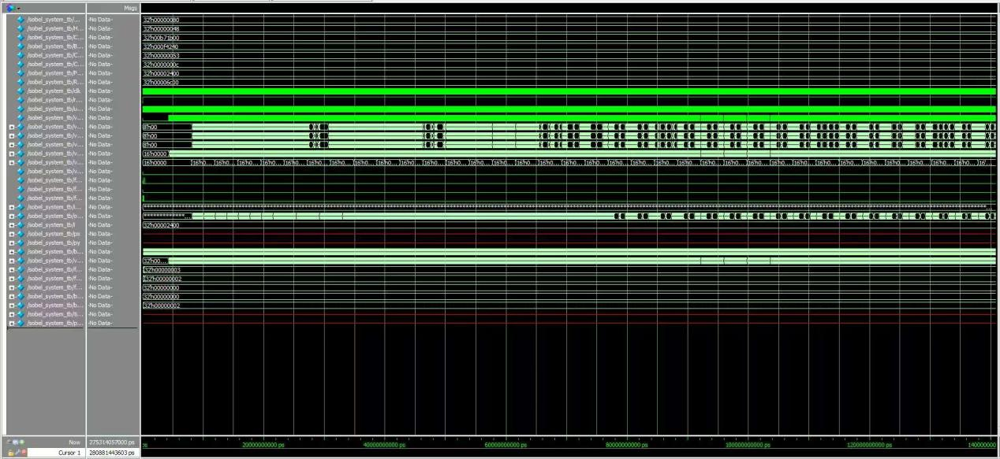
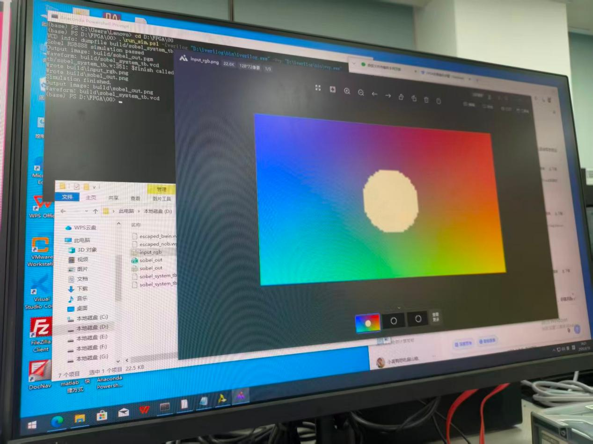
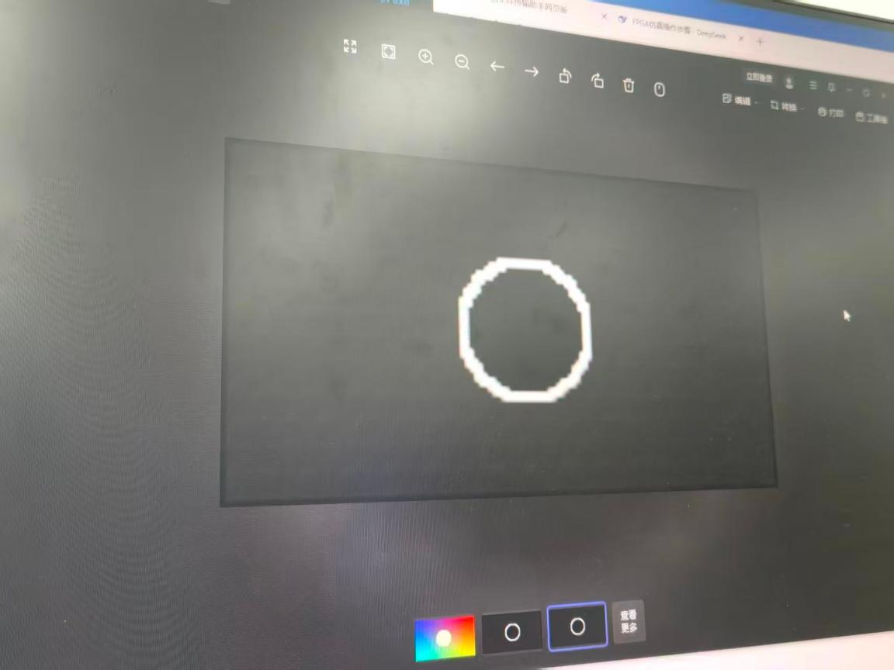

# 实验 0：`sobel_00_rtl_sim`——RTL 仿真验证

## 基础实验

### 1. 实验目标

- 在纯仿真环境下，验证 UART 接收、RGB888 图像解析、灰度转换和 Sobel 边缘检测的完整数据流。
- 掌握 UART 帧协议格式，包括帧头、行头和像素数据。
- 学会通过波形关键信号 `frame_start`、`gray_valid`、`edge_valid` 和 `edge_frame_done` 判断一帧图像处理是否完成。

### 2. 输入图像与 UART 帧格式

输入图像由 `tools/gen_input_rgb.py` 生成，默认分辨率为 128×72，采用 RGB888 格式，像素数据按行写入 `data/input_rgb.hex`。该测试图包含彩色渐变背景、中心白色亮块、两条对角黑线和中央竖直红线，为 Sobel 算子提供了丰富的边缘特征。

UART 帧协议如下：

| 数据段 | 内容 | 说明 |
| --- | --- | --- |
| 帧头 | `55 AA` + 宽度 + 高度 + 格式码 `0x18` | 宽度和高度采用小端格式 |
| 行头 | `33 CC` + 行号 | 每行像素数据前发送一次 |
| 像素数据 | R、G、B 字节 | 每行 128 个像素，共 384 字节 |

整帧共 72 行。

*图 1：由 `gen_input_rgb.py` 生成的原始彩色输入图（128×72），包含渐变背景、中心亮块、对角黑线和中央竖直红线。*

### 3. 核心模块功能

- **`rgb_to_gray`：**采用近似公式 `Gray = (77R + 150G + 29B) >> 8`，将 24 位 RGB 转换为 8 位灰度，并输出 `gray_data` 和有效信号 `gray_valid`。
- **`sobel_core`：**利用行缓存构建 3×3 窗口，计算水平梯度 `Gx` 和垂直梯度 `Gy`；边缘强度取 `|Gx| + |Gy|`，输出 `edge_data` 和 `edge_valid`。整帧处理完成后，`edge_frame_done` 信号拉高一个周期。

*图 2：仿真输出的 Sobel 边缘检测结果。图像采用灰度显示，边缘越亮表示强度越高，结果与理论预期一致。*

### 4. 仿真结果与波形分析

仿真运行后生成 `build/sobel_out.pgm`，并通过脚本转换为 `sobel_out.png`。与输入图对比，边缘检测结果清晰，中心矩形边界、对角斜线及中央竖线两侧均被正确检出，背景平坦区域无噪声，验证了算法的正确性。

波形中的关键信号表现如下：

- `frame_start` 拉高后，`gray_valid` 连续输出 128×72 个有效灰度值。
- 随后，`edge_valid` 输出边缘强度。
- 最终，`edge_frame_done` 产生上升沿，表示一帧图像处理结束。

各信号的时序关系符合预期。

*图 3：ModelSim 仿真波形，标注了 `frame_start`、`gray_valid`、`edge_valid` 和 `edge_frame_done` 等关键信号；`edge_frame_done` 在帧末产生脉冲。*

---

## 扩展实验

### 扩展 1：更换输入图片并重新仿真

#### 修改方法

修改 `tools/gen_input_rgb.py` 中的 `pixel()` 函数。原始图像采用双线性渐变、中心矩形亮块、对角黑线和中央竖直红线，本次修改如下：

- **R 通道：**由从左到右递增的 `(x * 255) // (width - 1)`，改为左右反向渐变 `((width - 1 - x) * 255) // (width - 1)`，使红色分量从右向左增强。
- **G 通道：**保持从上到下递增不变。
- **B 通道：**由 `(x + y)` 渐变改为与 R 通道相同的左右反向渐变，实现蓝红反向叠加。
- **中心特征：**将原来的矩形亮块（灰度值 240）改为圆形亮斑。圆心位于图像中心，半径为 15 像素，颜色为亮黄色（R=255、G=255、B=200）。
- **其他特征：**对角黑线和中央竖直红线保持不变。

#### 仿真结果

重新运行仿真后，生成新的输入图和 Sobel 边缘图。输入图呈现左右色调反转：左侧偏蓝、右侧偏红，中心圆形亮斑取代原有矩形块。

Sobel 输出图中，圆形亮斑的边界形成连续的圆形边缘，与之前的矩形边缘形态明显不同。同时，由于左右渐变方向反转，水平方向的梯度分布也相应变化，斜向边缘的响应方向出现偏移。该对比说明，输入图像的色彩分布和几何形状会直接影响 Sobel 算子的梯度幅值分布和边缘轮廓，验证了算法对输入变化的敏感性。

*图 4：修改后的原始彩色输入图。中心为圆形亮斑，背景为左右反向渐变色，对角线和竖线保留。*

*图 5：修改后输入图对应的边缘检测结果。圆形亮斑边缘清晰可见，渐变方向变化导致水平梯度翻转。*

### 扩展 4：关键时序波形标注

#### 操作内容

本扩展不修改 RTL 代码，仅使用 GTKWave 打开 `build/sobel_system_tb.vcd` 波形文件，对仿真过程中的关键信号进行标注。重点关注以下信号：

- **`frame_start`：**帧头接收成功标志，表示新一帧开始。
- **`gray_valid`：**灰度像素有效信号，每输出一个灰度值时置高一次。
- **`edge_valid`：**边缘强度有效信号，每输出一个边缘值时置高一次。
- **`edge_frame_done`：**整帧边缘计算完成标志，在最后一个像素输出后产生单周期脉冲。

#### 波形分析

从标注后的波形中可以观察到：

1. `frame_start` 出现上升沿。
2. 经过若干微秒后（具体时间取决于 UART 波特率），`gray_valid` 开始连续输出 128×72 个间隔均匀的脉冲。
3. `edge_valid` 相对 `gray_valid` 存在由行缓存和流水线引起的固定延迟，但两者的脉冲数相同。
4. `edge_valid` 的最后一个脉冲结束约一个时钟周期后，`edge_frame_done` 出现上升沿，表示整帧处理完毕。

所有信号的时序关系符合预期，流水线运行稳定且无冲突。

*图 6：GTKWave 波形图，标注了 `frame_start`、`gray_valid`、`edge_valid` 和 `edge_frame_done`，并在 `edge_frame_done` 处注明帧结束时刻。*
